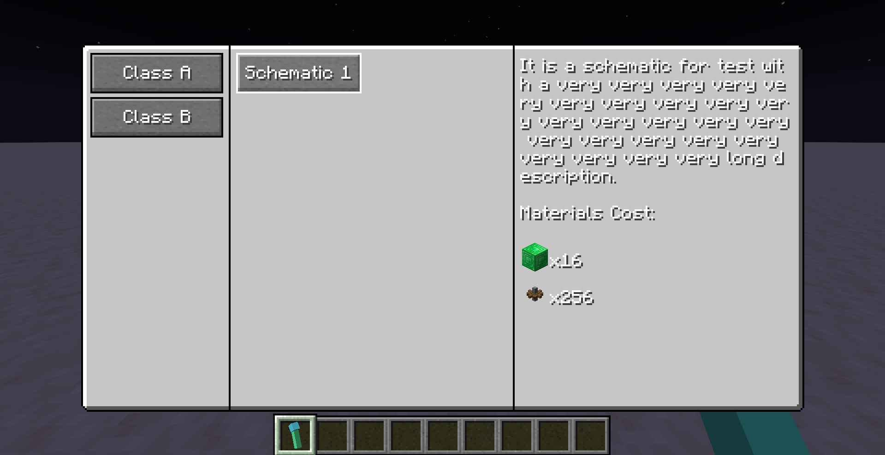
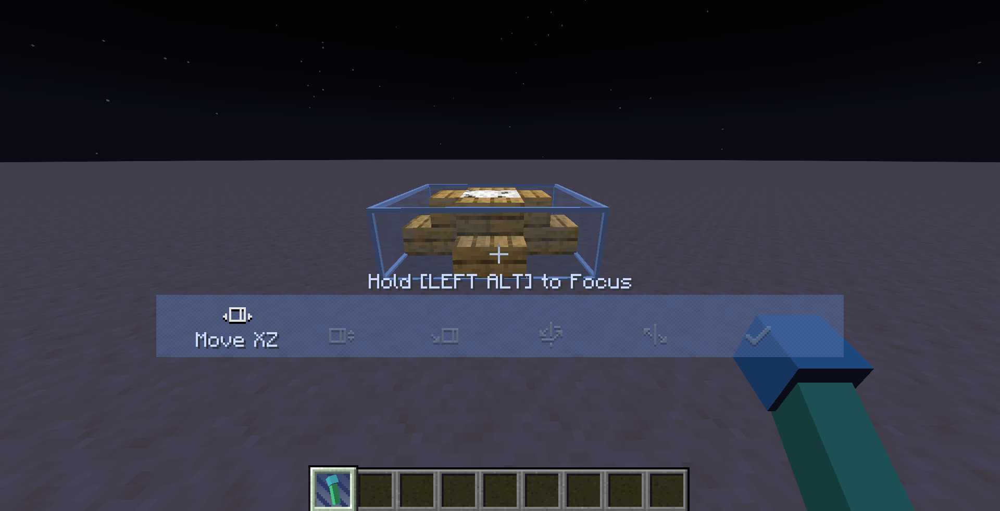
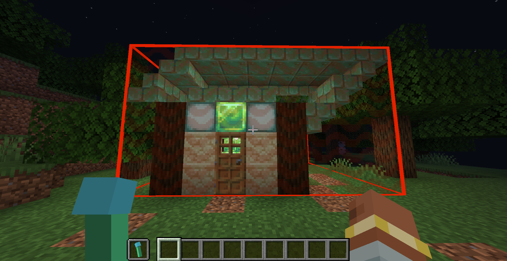

# Build Gun: A Create addon

A tool has been added to print blueprints in survival mode. Right-click to open the menu and select a blueprint. Shift + right-click to deselect the blueprint.

This mod is intended for modpack creation and is not ready to use out of the box. **If you do not configure it, the menu will be empty.**

## Configuration

The configuration file is located at `<game directory>/BuildGunData/config.json`. If you run this mod for the first time, an empty file will be automatically generated there.

This configuration file specifies which blueprints the Build Gun can use and the categories appear in the menu.

Example Configuration File:

Note: JSON does not support comments. The comments here are for readability only. If you want to use this example configuration file, remove all // comments.

```json
{
  "tabs": [  // This entry defines two categories
    { "id": "tab1", "name": "Class A" },  // 'id' is the unique identifier for the category; make sure it does not duplicate other category IDs. 'name' is the display name in the menu.
    { "id": "tab2", "name": "Class B" }
  ],
  "schematics": [  // This entry defines a blueprint
    {
      "id": "aaa",  // 'id' is the unique identifier for the schematic; it must not duplicate other schematic IDs.
      "name": "Schematic 1",  // 'name' is the display name of the schematic in the menu.
      "file": "s1.nbt",  // 'file' is the path of the schematic file, relative to `<game directory>/schematics`
      "tab": "tab1",  // 'tab1' indicates which category this schematic belongs to in the menu.
      "config": {  // 'config' contains settings for the schematic.
        "stage": 0,  // 'stage' is the minimum required stage for using this schematic. The mod includes a simple stage system (explained later). The schematic will only be available if the current world's stage is equal to or greater than the required stage.
        "description": "It is a schematic for test with a very very very very very very very very very very very very very very very very very very very very very very very very long description.",  // 'description' is the schematic's description, which will be displayed in the menu.
        "cost": [  // 'cost' defines the items required to print this schematic. If no cost is required, set 'cost' to an empty array [].
          {
            "id": "minecraft:emerald_block",  // 'id' is the item ID.
            "count": 16  // 'count' is the quantity required.
          },
          {
            "id": "create:cogwheel",
            "count": 256
          }
        ],
        "removable": true  // added in 0.0.3 version, mark whether the building can be removed, see 0.0.3 version update below
      }
    }
  ]
}

```

With the above configuration file, you will get the following menu:



## Next Steps in Configuration
The above configuration only declares which schematics appear in the menu. Next, you need to place the corresponding schematic files in the `<game directory>/schematics` directory.

How the Create Mod Finds Schematics?

When attempting to load a schematic named `s1.nbt`, the Create mod will:

1. Load the file `<game directory>/schematics/s1.nbt` on the client to display the preview.
2. Load the file `<game directory>/schematics/uploaded/<schematic owner name>/s1.nbt` on the server to actually print the schematic.

Here, `<schematic owner name>` depends on the player who uploaded the schematic. However, for the Build Gun in this mod, <schematic owner name> is always `__BuildGun__`.

Therefore, you need to place the schematic file in both `<game directory>/schematics/` and `<game directory>/schematics/uploaded/__BuildGun__/`.

> If you are configuring a dedicated server, the file technically only needs to be placed in the latter directory. However, if you are unfamiliar with the distinction between Minecraft client and server, placing it in both locations is recommended to avoid issues.

Once placed correctly, your directory structure should look like this:

```
<game directory>
|_ schematics
  |_ s1.nbt
  |_ uploaded
    |_ __BuildGun__
      |_ s1.nbt

```

The schematic filename `s1.nbt` corresponds to `"file": "s1.nbt"` in the previous section.

## If Everything is Configured Correctly

When you right-click to open the menu and click the `Schematic 1` button, you can use the Build Gun as a blueprint.

You can deploy, adjust, and print the blueprint.



## Additional Tips
1. After modifying the configuration file, changes will not take effect immediately. You need to run the /reload command to reload the configuration.
2. If you are using a dedicated server + client setup, /reload only reloads the server configuration. To reload the client-side configuration, use F3+T.
3. Use `/buildgun stage get` to check the current world stage.
4. Use `/buildgun stage set` to set the current world stage.
5. The "stage" system is simply an integer, and you can define its meaning freely—for example, 0 for the Stone Age, 1 for the Iron Age, 2 for the Industrial Age, etc.
6. By setting stage requirements for schematics in the configuration file, you can restrict players from using certain schematics until they reach a specific stage.(e.g., use ftb quest, commit quest, set stage).
7. In the configuration file, "name" and "description" are translatable text. You can set them as translation keys, such as "my.modpack.schematic1.name". Then, by adding the corresponding translations in a resource pack, you can easily implement i18n.

## Ambiguous Edge Cases?
You might wonder what happens if the server and client configurations do not match.

For example, if you run a dedicated server and an untrustworthy player modifies their client configuration, could they print blueprints that should not be available on the server?

The answer is no. Even if they modify the client configuration to display unauthorized schematics in their menu, the server will still validate the request before printing. The server checks whether the requested schematic exists in its own configuration, whether the required stage is met, and whether the necessary materials are available. If any of these conditions are not met, printing will not proceed.

## A Potential Exploit
In an extreme case, an untrustworthy player could exploit the system to print any schematic they want.

Exploit Process:
1. Use `__BuildGun__` as their username.
2. Upload a schematic with the same name using a blueprint table or other methods, overwriting the server-side schematic at `<game directory>/schematics/uploaded/__BuildGun__/`.
3. This would allow them to use the Build Gun to print any schematic they uploaded.

A simple fix for this exploit is to ban players with the username `__BuildGun__`.

## New Features in Version 0.0.3
When the Build Gun is held in the off-hand, it enters demolition mode, allowing you to remove constructed blueprints by right-clicking.



You can specify in the configuration file whether a schematic can be removed.

The demolition logic checks each block within the range against the schematic. If a block matches the schematic, it is removed; otherwise, it remains.

As a result, any manually added blocks or blocks that have changed state after construction will be preserved.

The necessary information for demolition is generated at the time of construction. Therefore, if `"removable": true` was not set in the configuration during construction, modifying the configuration later will not allow the structure to be removed.

In this version removing buildings will not return materials. It may be added in future versions.

## A Potential Exploit in Demolition Mode

Since there is no validation of the distance between the player and the structure being demolished, an untrustworthy player could forge packets to remove buildings from any distance.

## 0.0.4 Changelog

Fixed a bug that the building bounding box was incorrectly positioned when placed with rotation and mirroring.

## 0.0.5 Changelog

Fixed the issue where buildings could not be removed cleanly or would produce additional drops when removed.

# 机械动力 | 建造枪

添加了一个在生存模式中打印蓝图的工具。右键以打开菜单选择蓝图，Shift+右键取消选择的蓝图。

该模组面向整合包制作，它不是开箱即用的，如果你不进行配置，菜单将会是空的。

## 配置

配置文件位于 `<game directory>/BuildGunData/config.json`，如果你是第一次运行本模组，将会有一个空文件自动生成于此。

该配置文件指定了建造枪能够使用的蓝图，以及菜单中不同的分类。

一个示例配置文件如下：

注意，json中是没有注释语法的，这里只是为了方便阅读。如果要使用该示例配置文件，请将所有 // 注释删除。
```json
{
  "tabs": [  // 此条目定义了两个分类
    { "id": "tab1", "name": "Class A" },  // id 为分类的唯一标识符，请不要与其他分类的 id 重复；name 为分类在菜单中显示的名称
    { "id": "tab2", "name": "Class B" }
  ],
  "schematics": [  // 此条目定义了一个原理图
    {
      "id": "aaa",  // id 为原理图的唯一标识符，请不要与其他原理图的 id 重复
      "name": "Schematic 1",  // name 为原理图在菜单中显示的名称
      "file": "s1.nbt",  // file 为原理图文件的路径，相对于 `<game directory>/schematics` 目录
      "tab": "tab1",  // tab1 表示原理图应该显示在哪个分类中
      "config": {  // config 为原理图的配置
        "stage": 0,  // stage 表示使用该原理图至少要所在的阶段，该模组内置了一个简易的阶段系统(详见后文)，只有当前世界所在的阶段大于等于原理图要求的阶段时，该原理图才能被使用以及显示在菜单中
        "description": "It is a schematic for test with a very very very very very very very very very very very very very very very very very very very very very very very very long description.",  // description 为原理图的描述，将会显示在菜单中
        "cost": [  // cost 定义了打印该原理图需要消耗的物品，如果不希望消耗物品，将 cost 设置为空数组 []
          {
            "id": "minecraft:emerald_block",  // id 为物品的 id
            "count": 16  // count 为物品的数量
          },
          {
            "id": "create:cogwheel",
            "count": 256
          }
        ],
        "removable": true  // 0.0.3 版本新增，标记建筑是否可以拆除，详见下文0.0.3版本更新
      }
    }
  ]
}
```

使用上述配置文件，将得到如下图所示的菜单：


## 下一步配置

上面的配置仅仅声明了菜单中显示的原理图。接下来，你需要在 `<game directory>/schematics` 目录下放置对应的原理图文件。

首先简单介绍机械动力查找原理图的机制。

当令其加载名为 `s1.nbt` 的原理图时，机械动力会
1. 在客户端加载 `<game directory>/schematics/s1.nbt` 文件，以此显示原理图的预览。
2. 在服务端加载 `<game directory>/schematics/uploaded/<schematic owner name>/s1.nbt` 文件，以此实际打印原理图。

其中 `<schematic owner name>` 取决于原理图的上传者，但是对于本模组的建造枪，`<schematic owner name>` 始终为 `__BuildGun__`。

所以，你需要将原理图文件放置于`<game directory>/schematics/`目录以及`<game directory>/schematics/uploaded/__BuildGun__/` 目录下。

> 如果你配置的是专用服务端，事实上只需要放置于后者中，但如果你不熟悉mc客户端服务端的概念，建议两个目录都放置以求无误。

放好原理图后你的目录结构是这样的：

```
<game directory>
|_ schematics
  |_ s1.nbt
  |_ uploaded
    |_ __BuildGun__
      |_ s1.nbt
```

原理图的文件名`s1.nbt`对应了上一节中的`"file": "s1.nbt"`。


## 如果你配置正确

当你右键打开菜单，点击`Schematic 1`按钮后，你就可以把建造枪当作蓝图使用了。

你可以部署、调整、打印蓝图。


## 额外提示

1. 当你修改了配置文件后，配置不会立即生效。你需要运行/reload命令来重新加载配置。
2. 如果你在专用服务端+客户端环境下配置，/reload只会重新加载服务端处的配置，如果你想重新加载客户端处的配置，请使用F3+T。
3. 使用`/buildgun stage get`命令可以查看当前世界所在的阶段。
4. 使用`/buildgun stage set`命令可以设置当前世界所在的阶段。
5. 事实上所谓阶段就是一个整数，你可以自由定义阶段的含义，比如0代表石器时代，1代表铁器时代，2代表工业时代等等。
6. 通过在配置文件中设置原理图的阶段要求，以此来限制玩家在不同阶段使用不同的原理图。(比如搭配ftb任务，完成任务，设置阶段)
7. **配置文件中，"name"和"description"都是可翻译文本**，你可以将它们设置为翻译键，如"my.modpack.schematic1.name"。然后在资源包中添加对应的翻译文件即可轻易实现i18n。

## 模棱两可的特殊情况？

你可能会好奇，如果服务端和客户端的配置不一致会发生什么。

如果你开了一个专用服务器，有不安分的玩家修改了他们客户端的配置，能够在服务端中打印不该有的原理图吗？

答案当然是不行的。即使修改了客户端配置，使得客户端菜单中出现了不该有的原理图，但在请求打印时，服务端会检查请求的原理图是否在服务端配置中定义，以及阶段是否满足，材料是否足够，上述条件缺一则不会进行打印。

## 一个可能的漏洞

在某种极端的情况下，不安分的玩家可以通过巧妙的操作打印任意原理图。

操作流程如下：

1. 使用 `__BuildGun__` 作为用户名
2. 使用蓝图桌或其他手法上传重名的原理图，把服务端`<game directory>/schematics/uploaded/__BuildGun__/`目录下的原理图覆盖掉
3. 从而可以通过建造枪打印自己上传的任意原理图

这个漏洞也有一个简单的解决方案：ban掉名为`__BuildGun__`的玩家。

## 0.0.3 版本新增功能

当将建造枪放于副手时，将进入拆除模式，右键点击可以将建造的蓝图拆除。


可在配置文件中指定原理图是否能够拆除。

拆除的逻辑是逐一核对范围内的方块是否与原理图一致，如果一致则拆除，否则不拆除。

因此，在建造完成后人为再添加的方块，以及状态改变的方块将保留。

拆除建筑所需的信息是在建造时生成的，因此，如果你在建造时配置中未设置`"removable": true`，那么即使后来修改了配置文件，也无法拆除。

当前版本拆除建筑不会返还材料，该功能可能会在后续版本中加入。

## 拆除模式的一个漏洞

因为并未核对玩家请求拆除的建筑和玩家所在位置的距离， 不安分的玩家可以通过伪造数据包无视距离拆除建筑。

## 0.0.4 更新日志

修复建筑边框生成不正确的问题。

## 0.0.5 更新日志

修复无法干净地移除建筑或移除建筑会产生额外掉落物的问题
